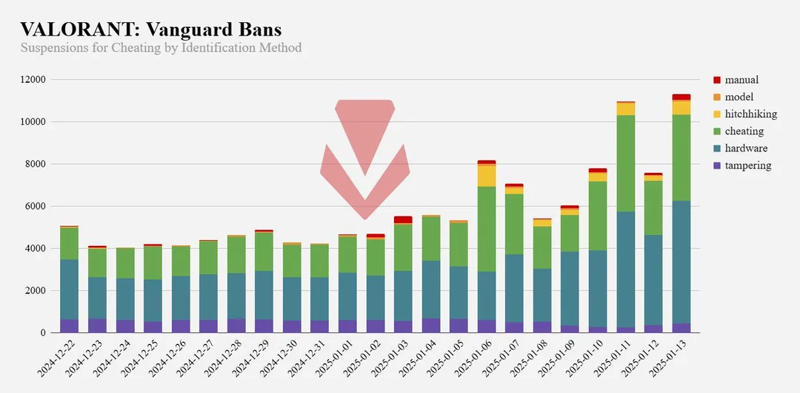

# AntiCheat 101

## The Defender's Problem

Cheating is usually easier than defending at scale.

Anticheat systems aim to maintain a fair and enjoyable gaming environment by detecting and preventing unauthorized advantages without disrupting legitimate players. At their core, these systems balance proactive and reactive measures, such as code integrity checks, memory scanning, and behavior analysis, against the risk of false positives that could frustrate honest users. Because a game’s longterm revenue depends on player satisfaction, anticheat strategies prioritize minimal performance impact and seamless updates, ensuring security features do not degrade the user experience.&#x20;

Furthermore, developers must navigate legal boundaries (for example, respecting terms of service and avoiding overreach into protected system areas) and privacy concerns (collecting only necessary data, anonymizing logs, and complying with regulations like GDPR). By combining technical safeguards with clear policies and transparent communication, anticheat efforts protect both the integrity of gameplay and the trust of the player community.

#### Preventing vs Punishing

Preventing cheating is the primary objective of any anticheat system: robust measures are put in place to stop unauthorized tools or behavior before they can affect gameplay. If a player circumvents these defenses, the focus shifts to detecting malicious activity, such as memory tampering or network manipulation and applying appropriate penalties.

#### Effective punishments

Effective punishments are designed to deter repeat offenses and uphold a positive user experience. Sanctions range from temporary account suspensions to permanent bans, and can include hardware or network‐level restrictions. In particular, "hardware bans" (also known as trace bans) tie the restriction to device identifiers, making it significantly more difficult for banned users to return under a different account.

<figure><figcaption><p><a href="https://x.com/deteccphilippe/status/1878950002632053203">https://x.com/deteccphilippe/status/1878950002632053203</a></p></figcaption></figure>

#### Technical possibilities and limitations

Usermode anticheat runs in roughly the same world as the game. That makes it easier to ship, easier to update, and less invasive than a driver, but the trust boundary is thin. It can scan process memory, verify game files, watch loaded modules, inspect handles, validate important code paths, hook selected APIs, and look for suspicious behavior around graphics, input, overlays, and game state. Those signals are useful, especially against cheap cheats and sloppy loaders.

The limitation is that usermode is not above the attacker. Internal cheats can read normal game memory with direct pointers. Kernel cheats can tamper with usermode hooks, hide activity from normal process views, or patch the anticheat itself. DMA hardware can read and write memory without going through the usermode APIs the anticheat is watching. Even when a signal exists, scanning too aggressively can hurt performance, create false positives, or annoy legitimate players. Good usermode detection is usually a layered signal system, not one magic check.

Simple usermode hook:

```cpp
#include <windows.h>
#include "MinHook.h"

// Protected range in game’s address space
static const uintptr_t PROT_BASE = 0x00ABC000;
static const size_t    PROT_SIZE = 0x1000;  // [0x00ABC000 … 0x00ABD000)

typedef BOOL (WINAPI* tRPM)(
    HANDLE  hProcess,
    LPCVOID lpBaseAddress,
    LPVOID  lpBuffer,
    SIZE_T  nSize,
    SIZE_T* lpNumberOfBytesRead
);
static tRPM oReadProcessMemory = nullptr;

BOOL WINAPI hkReadProcessMemory(
    HANDLE  hProcess,
    LPCVOID lpBaseAddress,
    LPVOID  lpBuffer,
    SIZE_T  nSize,
    SIZE_T* lpNumberOfBytesRead
) {
    uintptr_t addr = (uintptr_t)lpBaseAddress;
    if (addr >= PROT_BASE && addr < PROT_BASE + PROT_SIZE) {
        OutputDebugStringA("AntiCheat: Protected range read detected!\n");
        // → Flag or counter‐measure here
    }
    return oReadProcessMemory(hProcess, lpBaseAddress, lpBuffer, nSize, 
                              lpNumberOfBytesRead);
}

void InstallRPMHook() {
    MH_Initialize();
    MH_CreateHook(&ReadProcessMemory, &hkReadProcessMemory,
                  reinterpret_cast<LPVOID*>(&oReadProcessMemory));
    MH_EnableHook(&ReadProcessMemory);
}

BOOL APIENTRY DllMain(HMODULE hModule, DWORD reason, LPVOID) {
    if (reason == DLL_PROCESS_ATTACH) {
        InstallRPMHook();
    }
    return TRUE;
}
```

Kernelmode anticheat drivers move the defender closer to the operating system. They can observe process and thread activity from a stronger position, inspect handles across processes, validate memory access, watch image loads, block some injections earlier, and make usermode tampering harder. This helps against cheats that simply outprivilege the game process.

That power comes with a real cost. A kernel driver is part of the trusted computing base. A bug can crash the machine. A security flaw can become a full system compromise. A careless data collection design can expose sensitive memory, input, files, network data, or other applications. Kernelmode anticheat should be built around strict data minimization, clear boundaries, careful telemetry, and privacy rules like GDPR. The goal is not to collect everything. The goal is to collect the smallest amount of high quality evidence needed to make a fair decision.

So the tradeoff is not just usermode versus kernelmode. It is detection strength, player trust, system stability, privacy, performance, and false positive risk all fighting each other. That is why anticheat work is messy. Cheaters only need one working gap. Defenders need something accurate enough to act on without breaking the game or the user machine.

Simple kmd hook example:

```cpp
#include <ntddk.h>

typedef NTSTATUS (NTAPI* tNtReadVM)(
    HANDLE    ProcessHandle,
    PVOID     BaseAddress,
    PVOID     Buffer,
    ULONG     NumberOfBytesToRead,
    PULONG    NumberOfBytesRead
);

extern PVOID* KeServiceDescriptorTableShadow; // Pointer to SSDT
static tNtReadVM  origNtReadVM = NULL;
static PEPROCESS  gGameProcess = NULL;
static const uintptr_t PROT_BASE = 0x00ABC000;
static const size_t    PROT_SIZE = 0x1000;  // [0x00ABC000 … 0x00ABD000)

// Hooked version of NtReadVirtualMemory
NTSTATUS HK_NtReadVM(
    HANDLE    ProcessHandle,
    PVOID     BaseAddress,
    PVOID     Buffer,
    ULONG     NumberOfBytesToRead,
    PULONG    NumberOfBytesRead
) {
    PEPROCESS targetProc;
    // 1. Get EPROCESS for the target handle
    if (NT_SUCCESS(PsLookupProcessByProcessId(ProcessHandle, &targetProc))) {
        // 2. Compare with our game’s EPROCESS pointer
        if (targetProc == gGameProcess) {
            uintptr_t addr = (uintptr_t)BaseAddress;
            // 3. If read falls within protected range, flag it
            if (addr >= PROT_BASE && addr < PROT_BASE + PROT_SIZE) {
                DbgPrint("AntiCheat: Protected range read detected in kernel‐mode!\n");
                // → Could terminate or quarantine the calling process here
            }
        }
        ObDereferenceObject(targetProc);
    }
    // 4. Call the original NtReadVirtualMemory
    return origNtReadVM(ProcessHandle, BaseAddress, Buffer, NumberOfBytesToRead, NumberOfBytesRead);
}

// Installs the SSDT hook for NtReadVirtualMemory
VOID InstallKernelHook(PEPROCESS GameProcess) {
    // 1. Store the game’s EPROCESS pointer for later comparison
    gGameProcess = GameProcess;

    // 2. Locate the SSDT entry for NtReadVirtualMemory (index depends on Windows version)
    //    For illustration, assume index 0x3C; real code must discover it dynamically.
    const ULONG NtReadVM_Index = 0x3C; 
    PVOID* ssdt  = KeServiceDescriptorTableShadow[0]; 
    origNtReadVM = (tNtReadVM)ssdt[NtReadVM_Index];

    // 3. Replace the SSDT pointer with our hook
    KIRQL oldIrql = KeRaiseIrqlToDpcLevel();
    ssdt[NtReadVM_Index] = HK_NtReadVM;
    KeLowerIrql(oldIrql);
}

// Driver unload cleans up the hook
VOID DriverUnload(PDRIVER_OBJECT DriverObject) {
    // Restore original SSDT entry
    const ULONG NtReadVM_Index = 0x3C;
    PVOID* ssdt = KeServiceDescriptorTableShadow[0];
    ssdt[NtReadVM_Index] = origNtReadVM;
    DbgPrint("AntiCheat: Kernel-mode detection driver unloaded\n");
}

NTSTATUS DriverEntry(PDRIVER_OBJECT DriverObject, PUNICODE_STRING RegistryPath) {
    UNREFERENCED_PARAMETER(RegistryPath);
    DriverObject->DriverUnload = DriverUnload;

    // 1. Find the EPROCESS for our game by PID (say, 1234)
    HANDLE gamePid = (HANDLE)1234;
    if (!NT_SUCCESS(PsLookupProcessByProcessId(gamePid, &gGameProcess))) {
        DbgPrint("AntiCheat: Failed to find Game EPROCESS\n");
        return STATUS_UNSUCCESSFUL;
    }

    // 2. Install the SSDT hook
    InstallKernelHook(gGameProcess);
    DbgPrint("AntiCheat: Kernel-mode detection driver loaded\n");
    return STATUS_SUCCESS;
}
```
