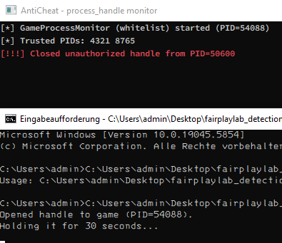

# usermode:process\_handle

**Cheat**

**Type**: External usermode

**Goal**: Obtaining process handle too perform memory reads/writes.

**AntiCheat**

**Type**: Usermode

**Goal**: Monitor active handles and block suspicious handles.


Notes:

Many legit / non malicious processes open handles to game processes, banning based on handles is not directly possible, but we can easily block non whitelisted or suspicious handles and further investigate origin processes. For many games like Counter Strike not enforcing very strict limitations opening or hijacking a handle doesnt really matter, they have not been banning based on handles too the process. Because/due too user experience, theres many legit processes which require a handle too the game.

<figure><figcaption><p><a href="https://github.com/0x90sh/fairplaylab_detections/tree/main/usermode-process_handle">https://github.com/0x90sh/fairplaylab_detections/tree/main/usermode-process_handle</a></p></figcaption></figure>

#### Cheater

Using OpenProcess to open / create and obtain a handle to the target game process, in order to interact with the process.

```cpp
DWORD gamePid = std::stoul(argv[1]);
HANDLE hGame = OpenProcess(
    PROCESS_QUERY_INFORMATION | PROCESS_VM_READ,
    FALSE,
    gamePid
);
```

#### AntiCheat

AntiCheat can enumerate all handles, keep track (count) and whitelist certain process handles via signature, licenses or just PID. (pid in our simple POC) We will just block any new opened handle and only allow a certain whitelist. (Which opens a backdoor for cheaters -> handle hijacking)

Windows handles are valid only within the process that owns them, so you cannot directly inspect or close another process’s handle. Following pseudo code visualizes the code flow.

```cpp
// Pseudo‐code for user‐mode handle detection
DWORD myPid = GetCurrentProcessId();
std::vector<SystemHandle> handles = NtQuerySystemHandleInformation(); // returns all system handles
for (auto& h : handles) {
    if (h.targetPid == myPid && !isWhitelisted(h.ownerPid)) {
        HANDLE srcProc = OpenProcess(PROCESS_DUP_HANDLE, FALSE, h.ownerPid);
        DuplicateHandle(srcProc, (HANDLE)(ULONG_PTR)h.handleValue, NULL, NULL, 0, 0, DUPLICATE_CLOSE_SOURCE);
        std::cout << "Closed handle from PID " << h.ownerPid << "\n";
        CloseHandle(srcProc);
    }
}
```

**Cheater Bypass**

Cheaters can now bypass this detection/prevention with hijacking an existing or in our case whitelisted handle.

```cpp
// Pseudo‐code for hijacking a handle from a whitelisted process
DWORD sourcePid          = WHITELISTED_PID;       // PID that already has a valid handle to the game
HANDLE srcProc           = OpenProcess(PROCESS_DUP_HANDLE, FALSE, sourcePid);
HANDLE hijackedGameHandle = NULL;
DuplicateHandle(
    srcProc,
    (HANDLE)(ULONG_PTR)knownHandleValue,  // the handle in sourcePid that points to the game
    GetCurrentProcess(),
    &hijackedGameHandle,
    PROCESS_ALL_ACCESS,
    FALSE,
    DUPLICATE_SAME_ACCESS
);
if (GetProcessId(hijackedGameHandle) == targetGamePid) {
    // Successfully hijacked a valid handle to the game
}
CloseHandle(srcProc);
```

You can find full source of the PoC here: [https://github.com/0x90sh/fairplaylab\_detections/tree/main/usermode-process\_handle](https://github.com/0x90sh/fairplaylab_detections/tree/main/usermode-process_handle)&#x20;
