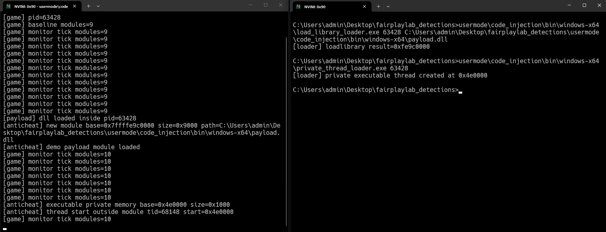

# Code Injection

**Cheat**

**Type**: External and internal usermode

**Goal**: Run code inside the game process.

**AntiCheat**

**Type**: Usermode

**Goal**: Detect new modules, private executable memory, and suspicious thread start addresses.

Notes:

Code injection is the bridge between external and internal cheating. The external process only needs to get code running inside the game once. After that, the cheat gets the same kind of access as the internal memory example.

The obvious path is `VirtualAllocEx`, `WriteProcessMemory`, and `CreateRemoteThread` with `LoadLibraryA`. This loads a real dll, calls `DllMain`, and gives the target a normal module entry. That is easy to demo and easy to see.

Manual mapping is different. The injector maps a PE image itself instead of asking the windows loader to load it. A real mapper has to deal with sections, relocations, imports, TLS, entry point execution, and exception metadata. The interesting detection point is that badly or deliberately hidden manual maps often do not look like normal `MEM_IMAGE` modules. They show up as executable `MEM_PRIVATE`, strange `MEM_MAPPED`, orphan PE headers, or code that is reachable but missing from the loader module list.

This example does not ship a manual mapper. It uses a suspended no-op private executable thread to show the artifact that matters for detection. Executable private memory plus a thread start address outside known modules is already a strong signal.

<figure><figcaption><p><a href="https://github.com/0x90sh/fairplaylab_detections/tree/main/usermode/code_injection">https://github.com/0x90sh/fairplaylab_detections/tree/main/usermode/code_injection</a></p></figcaption></figure>

#### Injection Families

Classic dll injection is the loud version. The injector allocates a path inside the target, writes it, then starts a thread at `LoadLibraryA` or `LoadLibraryW`. Windows does the normal loader work. The result is visible in the module list, `DllMain` runs, imports get resolved normally, and the dll gets a real image backed mapping.

Detection is mostly about module trust and timing. A new module after startup is not automatically malicious, but it is a strong event. Check the path, signer, expected load order, parent process, thread start timing, and whether the module belongs to any known game, overlay, capture, or platform integration.

Manual mapping tries to skip the loader. The injector maps PE sections itself, applies relocations, resolves imports, handles TLS, and calls the entry point. A clean manual map can avoid the normal loader module list. A sloppy one leaves very loud artifacts.

Detection should compare loader view and memory view. If code exists in memory but the loader does not know about it, that gap matters. Look for executable `MEM_PRIVATE`, executable `MEM_MAPPED`, PE headers in private memory, suspicious section permission layouts, missing exception metadata, and threads or callbacks pointing into regions that are not normal modules.

Reflective loading is a manual mapping variant where the payload carries its own loader. It often starts as a blob in memory, finds its own PE headers, maps itself, resolves imports, and jumps into its payload. The same detection ideas apply, but the initial loader stub is often smaller and easier to miss if scans are slow.

Section mapping uses shared sections instead of simple `VirtualAllocEx` plus `WriteProcessMemory`. The injector maps the same section into itself and the target. It writes from one view and executes from the other. This can avoid some basic write tracking and make the memory type look different from plain private allocation.

Detection should care about executable mapped memory that is not a normal image. A mapped region with execute permissions and no sane module identity is not clean just because it is not `MEM_PRIVATE`.

APC injection queues work onto an existing thread. The payload runs when the target thread enters an alertable state. This avoids a fresh remote thread, but execution still lands at some address. If that address is private executable memory, a strange mapped section, or a stomped image section, the artifact remains.

Thread context hijacking reuses an existing thread more directly. The injector suspends a thread, changes its instruction pointer, and resumes it. This avoids the obvious remote thread start event. The detection angle shifts to context sampling, private executable memory, and important worker threads suddenly executing outside expected code.

`SetWindowsHookEx` loads a hook dll through the windows hook mechanism. It is more relevant for GUI processes and overlays. It can look less suspicious than a raw remote thread because Windows is doing the load, but the result is still a module. Validate hook modules, target threads, signer, path, and whether the process should accept GUI hooks at all.

Module stomping abuses trust in image backed memory. The attacker loads or reuses a legit module, changes code inside it, and runs from that module range. Simple checks pass because the instruction pointer is inside a module and the memory type can still look image backed.

This is why module presence is not enough. You also need image section integrity. Hash executable sections, compare critical code bytes against disk or a clean baseline, check whether image pages became private copy on write pages, and watch for unexpected writable or executable permission changes inside known modules.

Export and IAT hooking are smaller versions of the same problem. Instead of mapping a full payload, the attacker changes where calls go. Look at imported function pointers, export prologues, vtables, callback tables, and engine interface pointers. A pointer into an unexpected module or private executable memory is a strong lead.

#### AntiCheat

The demo process takes a baseline module list at startup, then reports modules that appear later.

```cpp
if (!known_module(module.base)) {
    std::cout << "[anticheat] new module\n";
}
```

The memory scanner walks the local address space with `VirtualQuery` and flags executable private memory.

```cpp
if (info.State == MEM_COMMIT &&
    info.Type == MEM_PRIVATE &&
    has_execute(info.Protect)) {
    std::cout << "[anticheat] executable private memory\n";
}
```

The thread scanner enumerates threads and asks for the win32 start address. A thread that starts outside every known module is suspicious.

```cpp
if (!address_in_modules(start, modules)) {
    std::cout << "[anticheat] thread start outside module\n";
}
```

For image section integrity, the idea is to treat loaded modules as something that can change after load. A module being signed or known only tells you what got mapped, not whether the executable bytes are still clean.

Useful checks:

- hash important `.text` ranges after load
- compare memory bytes against the module file on disk
- ignore relocations and writable data sections when comparing
- flag executable image pages that become writable
- use working set information to find copy on write image pages
- validate that thread starts and callback pointers land in executable sections, not only inside a module range

The important distinction is `inside a module` versus `inside expected executable code`. Module stomping exists because many detections stop at the first one.

#### Stealth Tricks And Detection Notes

The quieter tricks mostly try to remove one obvious artifact. They rarely remove all of them.

Unlinking from loader lists hides from `CreateToolhelp32Snapshot`, `EnumProcessModules`, and basic PEB walking. It does not remove the mapped memory. A memory walk still sees committed executable regions. If a region has code and no sane loader identity, keep digging.

Header wiping removes `MZ`, `PE`, section names, and obvious PE metadata. This hurts lazy scanners, but it also creates its own weirdness. A region can still be executable, private, referenced by a thread, or used by a callback. Header wiping is not invisibility.

RW to RX permission staging avoids long lived RWX pages. The attacker writes while the page is writable, then flips it to executable. That beats checks that only look for RWX. It does not beat checks for executable private memory, image section changes, or suspicious permission transitions.

Thread hijacking avoids `CreateRemoteThread`, but execution still has to land somewhere. If the instruction pointer lands in private executable memory or a strange mapped region, that is a signal. Short lived hijacks are harder, so sample important threads and combine this with memory scans.

APC based loaders avoid immediate execution. The queued routine may run later on a real game thread. Detection cannot rely only on thread creation. Watch target thread behavior, alertable waits, callback addresses, and executable memory regions.

Module stomping makes the memory look safer because the address is inside a module. It does not make the bytes clean. Hashing sensitive image sections catches simple stomps. More careful implementations may restore bytes between checks, so random timing and high value function checks help.

PEB spoofing and fake loader entries try to make manual mapped code appear like a real module. Cross check the loader list against `VirtualQuery`, section type, backing file path, image size, headers, and whether the memory layout matches a normal PE mapping.

Known dll abuse loads a real signed module, then uses an exported function, code cave, or writable section as a landing area. Signature checks pass because the file is real. Integrity checks matter because trust was changed after load.

Syscall based loaders bypass usermode API hooks. They can avoid hooks on `LoadLibraryA`, `VirtualAllocEx`, `WriteProcessMemory`, or `CreateRemoteThread`. The final memory still has to exist, and code still has to execute. Hooking APIs is weaker than inspecting module, memory, thread, and code integrity state.

Delayed injection waits until the game is busy or until scans are less frequent. The answer is not just faster polling. Mix event based checks with random scan timing, protect high value functions, and check state transitions that should be stable.

The best usermode approach is layered:

- loader view for new or weird modules
- memory view for executable private or mapped regions
- thread view for execution outside expected code
- integrity view for modified image backed code
- pointer view for callbacks, vtables, imports, and engine interfaces

#### Limits

Usermode detection has blind spots. A serious injector can race scans, restore bytes, avoid long lived threads, abuse trusted modules, or wait for safe timing. A usermode anticheat should treat this as signal collection, not perfect prevention.

The useful rule is simple:

- module list tells you what the loader knows
- memory map tells you what actually exists
- thread starts tell you what is executing
- code hashes tell you what changed

The gap between those views is where injected code usually leaks.

#### Build

```bat
cmake -S . -B build -A x64
cmake --build build --config Release
```

#### Run

```bat
build\Release\game.exe
build\Release\load_library_loader.exe <pid> build\Release\payload.dll
build\Release\private_thread_loader.exe <pid>
```

Full source is here:

[https://github.com/0x90sh/fairplaylab\_detections/tree/main/usermode/code\_injection](https://github.com/0x90sh/fairplaylab_detections/tree/main/usermode/code_injection)

References:

- [CreateRemoteThread](https://learn.microsoft.com/en-us/windows/win32/api/processthreadsapi/nf-processthreadsapi-createremotethread)
- [VirtualAllocEx](https://learn.microsoft.com/en-us/windows/win32/api/memoryapi/nf-memoryapi-virtualallocex)
- [WriteProcessMemory](https://learn.microsoft.com/en-us/windows/win32/api/memoryapi/nf-memoryapi-writeprocessmemory)
- [LoadLibraryA](https://learn.microsoft.com/en-us/windows/win32/api/libloaderapi/nf-libloaderapi-loadlibrarya)
- [VirtualQuery](https://learn.microsoft.com/en-us/windows/win32/api/memoryapi/nf-memoryapi-virtualquery)
- [SetWindowsHookEx](https://learn.microsoft.com/en-us/windows/win32/api/winuser/nf-winuser-setwindowshookexa)
