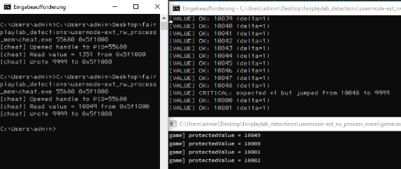

# usermode:ext\_rw\_process\_mem

**Cheat**

**Type**: External usermode

**Goal**: Read/write process memory of game proc from alternative / ext proc.

**AntiCheat**

**Type**: Usermode

**Goal**: Detect or prevent external processes memory reads/writes.

Notes:

If an external usermode cheat reads memory of the game process its pretty much impossible to reliably detect it. Within usermode the game/anticheat has only access too its own context and the read/write process memory calls happen entirely in the attackers context. This is one of the biggest limitations a usermode anticheat needs to work with. The only thing left is to harden its own process and essentially make it harder to reverse the game or access critical inmem data. (Which often is a lost cause)

On the other hand, memory writes can be detected with integrity checks, eventho these can get quiet CPU intensive if a certain memory region is regularly checked for malicious changes or hash checks.

A kernelmode anticheat comes pretty handy in these situations, since you can hook and analyse reads/writes to the games proc mem.

The difference to internal cheat context, is that we have more possibilites to detect actions  made by an intruder within our own processes context. But internal cheats don't require the read/write mem api anymore and can access pointers directly which essentially makes it undetectable again. (Proc hardening required again, Virtual Protect, exception handler, integrity checks etc.)

<figure><figcaption>
<a href="https://github.com/0x90sh/fairplaylab_detections/tree/main/usermode-ext_rw_process_mem">https://github.com/0x90sh/fairplaylab_detections/tree/main/usermode-ext_rw_process_mem</a>
</figcaption></figure>

In the PoC Demo its demonstrated how an AntiCheat might check for value integrity, since its unable too directly prevent memory read or writes. A common tactic often is also a hopefully sophisticated enc and runtime dec routine too make it harder reading values from mem. (Battlefield, COD anticheats use these strats for example)
