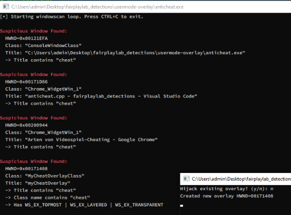

# usermode:overlay

**Cheat**

**Type**: External usermode

**Goal**: Obtaining a hWND / window for drawing overlays (ESP, menues etc.)

**AntiCheat**

**Type**: Usermode

**Goal**: Enumerate windows and block suspicious windows or remove topmost flags.


Notes:

Banning based on windows is pretty much impossible, if they are not using certain names/titles which are recongizeable, like UltraGoodCheat.cc. But AntiCheats can make it atleast a little hard to obtain/create a useable window for overlays, with blocking / removing certain window flags if window is not whitelisted for example: WS\_EX\_TOPMOST , WS\_EX\_LAYERED (still incredibly many false positive)

We could also scan for certain window flag combinations, but windows of explorer or native win windows sadly often also use the typical cheat overlay window flags. So further process analysis would be required.

<figure><figcaption><p><a href="https://github.com/0x90sh/fairplaylab_detections/tree/main/usermode-overlay">https://github.com/0x90sh/fairplaylab_detections/tree/main/usermode-overlay</a></p></figcaption></figure>

#### Cheater

Starts of with just creating his own window with flags/settings it requires.

```cpp
// Register our own overlay window class
const char* clsName = "MyCheatOverlayClass";
WNDCLASSEXA wc = { sizeof(WNDCLASSEXA), CS_HREDRAW | CS_VREDRAW,
                  OverlayProc, 0, 0, GetModuleHandleA(NULL),
                  NULL, LoadCursorA(NULL, IDC_ARROW),
                  NULL, NULL, clsName, NULL };
RegisterClassExA(&wc);

// Create a topmost, layered, transparent, click‐through window
hOverlay = CreateWindowExA(
    WS_EX_TOPMOST | WS_EX_LAYERED | WS_EX_TRANSPARENT | WS_EX_TOOLWINDOW,
    clsName, "myCheatOverlay",
    WS_POPUP,
    0, 0,
    GetSystemMetrics(SM_CXSCREEN),
    GetSystemMetrics(SM_CYSCREEN),
    NULL, NULL,
    wc.hInstance,
    NULL
);
// Fully transparent (alpha = 1)
SetLayeredWindowAttributes(hOverlay, 0, 1, LWA_ALPHA);
```

#### AntiCheat

We can monitor for suspicious window names, classes and flag combinations and then further analyze the process behind it etc.

```cpp
//using BOOL CALLBACK EnumWindowsProc(HWND hwnd, LPARAM)

// Check for suspicious substrings in title/class
for (const auto& keyword : { "cheat", "aimbot", "esp" }) {
    if (contains_ci(strTitle, keyword)) {
        reasons.push_back(std::string("Title contains \"") + keyword + "\"");
    }
    if (contains_ci(strClass, keyword)) {
        reasons.push_back(std::string("Class name contains \"") + keyword + "\"");
    }
}

// Check for extended style combination: topmost + layered + transparent
LONG exStyle = GetWindowLongA(hwnd, GWL_EXSTYLE);
if ((exStyle & WS_EX_TOPMOST) &&
    (exStyle & WS_EX_LAYERED) &&
    (exStyle & WS_EX_TRANSPARENT)) {
    reasons.push_back("Has WS_EX_TOPMOST | WS_EX_LAYERED | WS_EX_TRANSPARENT");
}
```

#### Cheater Bypass

Cheater can either create a legit seeming window, but even better would be too hijack an existing window wich already matches our requirements. (Stuff like nvidia, amd radeon overlays or discord overlay etc.)

```cpp
// Try NVIDIA GeForce Overlay
hOverlay = FindWindowA("CEF-OSC-WIDGET", "NVIDIA GeForce Overlay");
if (!hOverlay) {
    // Fallback: AMD Radeon Overlay
    hOverlay = FindWindowA(NULL, "AMD Radeon Overlay");
}
if (hOverlay) {
    // Make the found window topmost, layered, and click‐through
    // if it not already is
    LONG ex = GetWindowLongA(hOverlay, GWL_EXSTYLE);
    ex |= WS_EX_TOPMOST | WS_EX_LAYERED | WS_EX_TRANSPARENT;
    SetWindowLongA(hOverlay, GWL_EXSTYLE, ex);
    // Fully transparent (alpha = 1)
    SetLayeredWindowAttributes(hOverlay, 0, 1, LWA_ALPHA);
    std::cout << "Hijacked overlay HWND=" << hOverlay << "\n";
} else {
    std::cout << "No existing overlay found. Exiting.\n";
    return 0;
}
```
