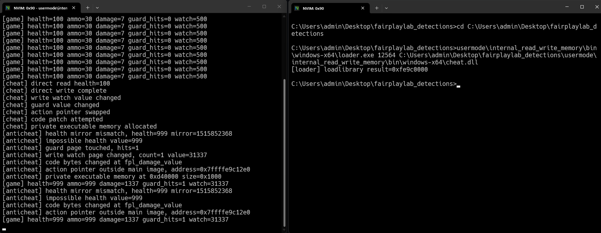

# internal read write memory

This demo shows what changes once the cheat is already inside the game process.



The annoying part is reads. An internal cheat can read normal game memory by dereferencing pointers. There is no clean `ReadProcessMemory` event, no external handle, and no obvious syscall to watch.

Writes are different. Writes leave damage behind. They change values, code bytes, function pointers, guard pages, write watch pages, or memory layout.

## files

- `src/game.cpp` starts the protected process and runs the usermode checks
- `src/cheat.cpp` builds `cheat.dll`, an internal payload that performs several memory changes
- `src/loader.cpp` loads the dll into the game process for the demo
- `bin/windows-x64/` contains prebuilt demo binaries

## what it checks

- direct value writes with a mirrored value
- writes into a `MEM_WRITE_WATCH` page
- reads or writes into a `PAGE_GUARD` page
- patching a small exported function
- swapping a function pointer to code outside the main image
- private executable memory created with `VirtualAlloc`

## build

```bat
cmake -S . -B build -A x64
cmake --build build --config Release
```

## run

Start the game:

```bat
build\Release\game.exe
```

Copy the pid, then load the internal payload:

```bat
build\Release\loader.exe <game_pid> build\Release\cheat.dll
```

Expected result:

- the dll reads health without a useful detection event
- the health write breaks the mirror check
- the guard page and write watch page fire
- the code patch changes the function bytes
- the function pointer points outside the main image
- the private executable page is found by the memory scanner

This is not full prevention. It is a set of usermode signals that make internal tampering harder to hide.
