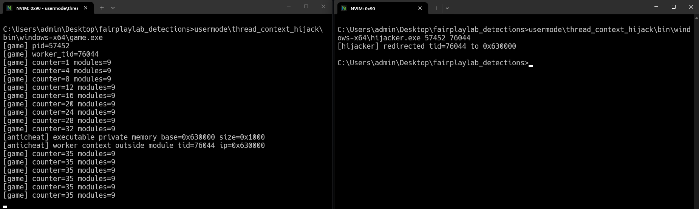

# thread context hijack

This demo shows why only looking for new remote threads is weak.



The target process starts a normal worker thread. The hijacker opens that thread, suspends it, changes its instruction pointer, and resumes it. No new thread is created for the payload.

The payload is just a tiny loop in private executable memory. That keeps the demo easy to inspect while still showing the important signal.

## files

- `src/game.cpp` starts a worker thread and monitors its instruction pointer
- `src/hijacker.cpp` redirects the worker thread into private executable memory
- `bin/windows-x64/` contains prebuilt demo binaries

## what it checks

- executable `MEM_PRIVATE` memory
- worker thread instruction pointer outside loaded modules
- a stalled worker counter after the hijack

## build

```bat
cmake -S . -B build -A x64
cmake --build build --config Release
```

## run

Start the target:

```bat
build\Release\game.exe
```

Copy the pid and worker tid, then run:

```bat
build\Release\hijacker.exe <pid> <worker_tid>
```

Expected result:

- the hijacker redirects the worker thread
- the monitor finds executable private memory
- the monitor reports the worker context outside normal modules
- the worker counter stops increasing

This is a detection demo. Real hijackers can restore context, race scans, or execute quickly, so the point is to show the signal surface.
